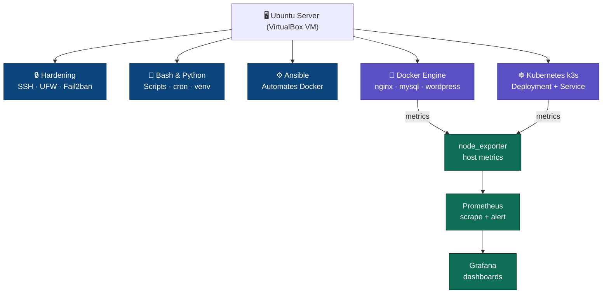

# SRE Homelab — Ubuntu + Docker + K8s + Ansible + Monitoring

Personal lab project implementing a complete SRE stack from scratch:
server hardening, containers, orchestration, infrastructure
automation, and observability.

## Stack
- Ubuntu Server 22.04/24.04
- Bash + Python (automation)
- Docker / Docker Compose
- Kubernetes (k3s)
- Ansible (IaC)
- Prometheus + Grafana + node_exporter

## Stack


## Architecture



## How to run it
```bash
git clone https://github.com/FabianCH20/sre-homelab-portfolio
cd sre-homelab-portfolio
ansible-playbook -i ansible/inventory.ini ansible/playbook.yml --check
```

## Documented incidents
See [incidentes-sre.md](incidentes-sre.md) — a real log of errors
found and resolved during implementation.
